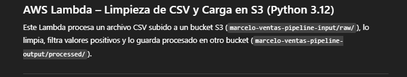
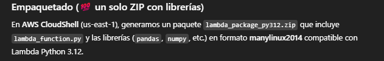
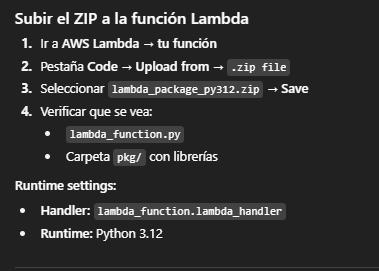
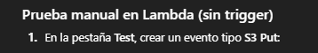
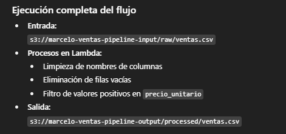

import os
import json
import logging
from urllib.parse import unquote_plus
from io import StringIO

import boto3
import pandas as pd

logger = logging.getLogger()
logger.setLevel(logging.INFO)

s3 = boto3.client("s3")

INPUT_BUCKET  = os.environ.get("INPUT_BUCKET",  "marcelo-ventas-pipeline-input")
OUTPUT_BUCKET = os.environ.get("OUTPUT_BUCKET", "marcelo-ventas-pipeline-output")
OUTPUT_PREFIX = os.environ.get("OUTPUT_PREFIX", "processed/")
if not OUTPUT_PREFIX.endswith("/"):
    OUTPUT_PREFIX += "/"

def _build_output_key(input_key: str) -> str:
    k = input_key.lstrip("/")
    if k.startswith("raw/"):
        return OUTPUT_PREFIX + k[len("raw/"):]
    return OUTPUT_PREFIX + k

def _clean_column_names(df: pd.DataFrame) -> pd.DataFrame:
    df.columns = (
        df.columns
        .str.strip()
        .str.lower()
        .str.replace(" ", "_")
        .str.replace(r"[^a-z0-9_]", "", regex=True)
    )
    return df

def _filter_positive(df: pd.DataFrame, col: str) -> pd.DataFrame:
    if col in df.columns:
        return df[pd.to_numeric(df[col], errors="coerce") > 0]
    logger.warning(f"Columna '{col}' no encontrada; no se filtra.")
    return df

def lambda_handler(event, context):
    try:
        logger.info("Evento: %s", json.dumps(event))
        rec = event["Records"][0]
        bucket = rec["s3"]["bucket"]["name"]
        key    = unquote_plus(rec["s3"]["object"]["key"])

        obj = s3.get_object(Bucket=bucket, Key=key)
        df = pd.read_csv(obj["Body"])

        df = _clean_column_names(df)
        df = df.dropna(how="all")
        df = _filter_positive(df, "precio_unitario")  # ajustar si aplica

        out_key = _build_output_key(key)
        buf = StringIO()
        df.to_csv(buf, index=False)
        s3.put_object(Bucket=OUTPUT_BUCKET, Key=out_key, Body=buf.getvalue())

        msg = f"OK -> s3://{OUTPUT_BUCKET}/{out_key}"
        logger.info(msg)
        return {"statusCode": 200, "body": msg}
    except Exception as e:
        logger.exception("Error en Lambda")
        return {"statusCode": 500, "body": str(e)}

# 1) Crear carpeta limpia
rm -rf build312 && mkdir -p build312/pkg && cd build312

# 2) Instalar dependencias correctas en pkg/ (sin Docker ni layers)
python3 -m pip install \
  --platform manylinux2014_x86_64 \
  --implementation cp \
  --python-version 312 \
  --only-binary=:all: \
  --no-deps \
  -t pkg \
  numpy==2.0.1 pandas==2.2.2 python-dateutil pytz tzdata

# 3) Crear el código Lambda (puedes subirlo o pegarlo aquí mismo)
cat > lambda_function.py <<'PY'
# (pegar aquí el código completo mostrado arriba)
PY

# 4) Armar el ZIP final
zip -r9 ../lambda_package_py312.zip . >/dev/null
cd ..
ls -lh lambda_package_py312.zip
# Debería pesar ~40 MB

{
  "Records": [
    {
      "s3": {
        "bucket": { "name": "marcelo-ventas-pipeline-input" },
        "object": { "key": "raw/ventas.csv" }
      }
    }
  ]
}

